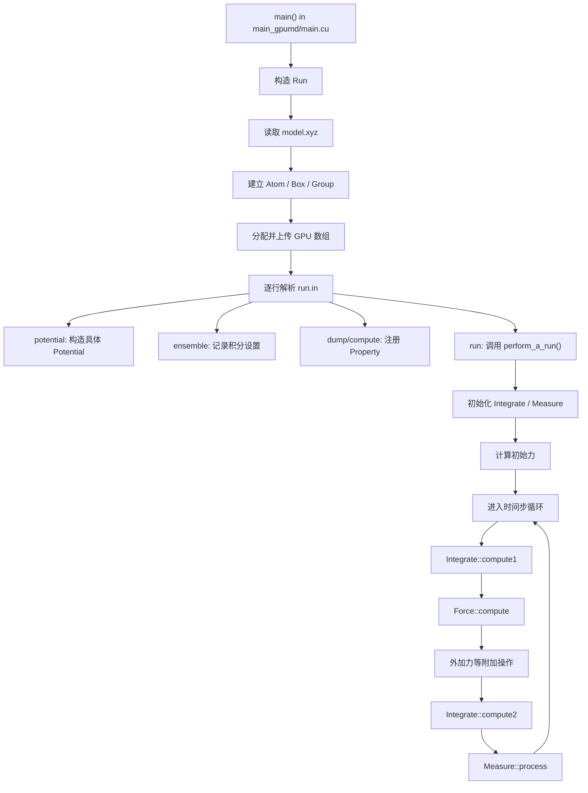

# GPUMD 项目理解与代码阅读指南

> 文档状态：学习路线草案  
> 适用对象：准备为 GPUMD 开发高分子拓扑与 bonded interactions、但尚不熟悉 GPUMD 代码结构的开发者  
> 对应项目：`developers/polymer_topology_bonded_development_roadmap_zh.md`

## 1. 学习目标

阅读 GPUMD 代码的目标不是立即理解所有势函数、系综和测量功能，而是先建立一个足以支持开发工作的心智模型。

完成本指南后，至少应能回答：

1. `gpumd` 从哪里启动？
2. `model.xyz` 和 `run.in` 分别在什么时候读取？
3. 原子数据存放在 CPU 还是 GPU？数组如何排列？
4. 一个 `run` 命令如何触发 MD 循环？
5. 一个时间步中位置、速度、力和测量按什么顺序更新？
6. 势函数如何接入 `Force`？
7. energy、force 和 virial 如何累加？
8. PBC 和 minimum image convention 在哪里处理？
9. 新的拓扑数据应该由谁持有，如何传递给力计算？
10. 新增 bonded 功能需要修改哪些模块，哪些模块暂时不用看？

建议采用以下学习原则：

- 先跑一个最小例子，再读对应调用链；
- 先读头文件了解对象职责，再读 `.cu` 实现；
- 先读简单功能，再读 NEP 等复杂实现；
- 每次只追踪一种数据，例如先只追踪 `position_per_atom`；
- 看到 CUDA kernel 时，先读调用它的 host wrapper；
- 用测试验证理解，不依赖“感觉代码应该如此”。

## 2. GPUMD 是什么样的程序

GPUMD 仓库中有多个可执行程序，当前最需要关注的是 `gpumd`：

| 目录 | 主要用途 | 当前优先级 |
|---|---|---:|
| `src/main_gpumd/` | `gpumd` MD 主程序、输入解析、主循环 | 最高 |
| `src/model/` | 原子、盒子、group 和 `model.xyz` | 最高 |
| `src/force/` | 势函数、邻居表、总力驱动 | 最高 |
| `src/integrate/` | NVE/NVT/NPT 等积分与系综 | 高 |
| `src/measure/` | thermo、轨迹、RDF 等测量和输出 | 中 |
| `src/utilities/` | GPU 内存、CUDA/HIP 兼容、单位、错误处理 | 高 |
| `src/minimize/` | 结构优化 | 后续 |
| `src/mc/` | Monte Carlo/MD 功能 | 暂缓 |
| `src/phonon/` | 声子与 Hessian | 暂缓 |
| `src/main_nep/` | NEP 训练程序，不是普通 MD 主循环 | 暂缓 |
| `src/main_gnep/` | GNEP 相关训练程序 | 暂缓 |
| `src/main_mdi/` | MDI 接口 | 暂缓 |

GPUMD 的核心特点是：

- 主要状态数组长期保存在 GPU；
- 大部分 `.cu` 文件同时包含 C++ host code 和 GPU kernel；
- `GPU_Vector<T>` 负责 GPU 内存的申请、释放和拷贝；
- 多数原子三维数组采用 structure-of-arrays（SoA）布局；
- `Force` 统一管理势函数计算；
- `Integrate` 统一选择并调用具体系综；
- `Measure` 统一管理输出和在线测量；
- CUDA 与 HIP 的 API 差异通过宏封装。

## 3. 一次 GPUMD 模拟的总流程

### 3.1 顶层调用链



### 3.2 入口文件

先读：

1. [`src/main_gpumd/main.cu`](../src/main_gpumd/main.cu)
2. [`src/main_gpumd/run.cuh`](../src/main_gpumd/run.cuh)
3. [`src/main_gpumd/run.cu`](../src/main_gpumd/run.cu)

`main()` 本身很短，普通情况只是构造一个 `Run` 对象。这里有一个很重要的代码风格：

> `Run::Run()` 构造函数不仅初始化对象，还会读取输入并执行整场模拟。

因此理解 `gpumd` 的关键不是停留在 `main()`，而是进入 `Run::Run()`。

`Run` 持有主要模块：

```text
Run
├── Atom atom
├── Box box
├── vector<Group> group
├── Force force
├── Integrate integrate
├── Measure measure
├── MC mc
├── Velocity velocity
└── 若干附加力模块
```

把 `Run` 理解成“单次 GPUMD 任务的总控制器”。

## 4. 输入文件如何进入程序

### 4.1 `model.xyz`

主要文件：

- [`src/model/read_xyz.cuh`](../src/model/read_xyz.cuh)
- [`src/model/read_xyz.cu`](../src/model/read_xyz.cu)
- [`src/model/atom.cuh`](../src/model/atom.cuh)
- [`src/model/box.cuh`](../src/model/box.cuh)
- [`src/model/group.cuh`](../src/model/group.cuh)

`initialize_position()` 负责读取 `model.xyz`，大致过程为：

```text
读取 run.in 中的 potential 文件名
    ↓
读取 potential 第一行，确定允许的元素及顺序
    ↓
读取 model.xyz 原子数
    ↓
读取 lattice、PBC 和 Properties
    ↓
读取每个原子的 species、position、mass、charge、velocity、group
    ↓
建立 CPU 端 Atom / Box / Group 数据
```

注意：程序在正式逐行执行 `run.in` 前，会先扫描其中的 `potential`，用势文件中的元素顺序解释 `model.xyz`。这意味着输入初始化与命令执行并不是完全独立的单次顺序解析。

### 4.2 `run.in`

重点读 `Run::execute_run_in()` 和 `Run::parse_one_keyword()`。

`run.in` 是逐行执行的命令流，而不是一次性解析成完整配置：

```text
potential ...  → 立即构造势函数
replicate ...  → 立即复制体系
ensemble ...   → 设置下一段 run 的系综
dump_* ...     → 注册测量对象
run N          → 立即执行 N 步模拟
```

因此命令顺序会影响行为。以后加入 `topology` 命令时，需要明确：

- 是在 `replicate` 前还是后加载；
- 多段 `run` 是否复用同一拓扑；
- 新拓扑是否允许中途替换；
- restart 是否重新加载拓扑。

### 4.3 最小输入例子

先看：

- [`examples/gpumd_static/run.in`](../examples/gpumd_static/run.in)
- [`examples/gpumd_static/model.xyz`](../examples/gpumd_static/model.xyz)

该例子使用 `time_step 0` 和 `run 1` 做接近单点计算的流程，适合第一次跟踪输入、力和输出。

建议随后自己建立一个只包含以下命令的临时例子：

```text
potential potential.txt
velocity 300 seed 42
ensemble nve
time_step 1
dump_thermo 1
dump_force 1
run 2
```

只跑两步，比一开始跑长模拟更适合阅读日志和跟踪调用。

## 5. 核心数据对象

### 5.1 `Atom`

文件：[`src/model/atom.cuh`](../src/model/atom.cuh)

`Atom` 同时保存部分 CPU 数据和主要 GPU 数据。

CPU 数据常用于：

- 初始化；
- 字符串元素符号；
- 文件输出；
- 需要 host 端逻辑的操作。

GPU 数据用于每一步 MD：

- `type`：原子类型；
- `mass`：质量；
- `charge`：电荷；
- `position_per_atom`：位置；
- `velocity_per_atom`：速度；
- `force_per_atom`：力；
- `potential_per_atom`：每原子势能；
- `virial_per_atom`：每原子 virial。

### 5.2 SoA 数组布局

三维数据不是按 `[x0,y0,z0,x1,y1,z1,...]` 排列，而是：

```text
position_per_atom:
[x0, x1, ..., xN-1,
 y0, y1, ..., yN-1,
 z0, z1, ..., zN-1]
```

所以常见代码是：

```cpp
double* x = position.data();
double* y = position.data() + N;
double* z = position.data() + 2 * N;
```

`force_per_atom` 使用同样布局。

`virial_per_atom` 有 9 个长度为 `N` 的分量数组。代码中的分量编号为：

```text
tensor:
xx xy xz       index:
yx yy yz       0 3 4
zx zy zz       6 1 5
               7 8 2  （按代码注释理解各偏移）
```

实际访问方式是 `virial[n + component * N]`。开发 bonded 时必须与现有顺序完全一致。

### 5.3 `GPU_Vector<T>`

文件：[`src/utilities/gpu_vector.cuh`](../src/utilities/gpu_vector.cuh)

优先理解以下接口：

```cpp
resize(size)
resize(size, initial_value)
data()
size()
copy_from_host(...)
copy_to_host(...)
fill(...)
```

需要注意：

- `GPU_Vector` 默认分配 device global memory；
- `data()` 返回 device pointer；
- host 代码不能把普通 device pointer 当 CPU 数组遍历；
- `operator[]` 返回底层指针元素引用，但对默认 device memory 不应在 host 端随意使用；
- 每次 `resize()` 会释放并重新分配；
- kernel launch 后使用 `GPU_CHECK_KERNEL` 检查错误。

### 5.4 `Box`

文件：

- [`src/model/box.cuh`](../src/model/box.cuh)
- [`src/model/box.cu`](../src/model/box.cu)

`Box::cpu_h[0..8]` 保存盒矩阵，`cpu_h[9..17]` 保存其逆矩阵。

`apply_mic()` 同时可在 host 和 device 调用，负责 minimum image convention，并区分正交盒和 triclinic 盒。开发 bond、angle、dihedral 时应复用它，不要另写只支持正交盒的 PBC。

### 5.5 `Group`

文件：

- [`src/model/group.cuh`](../src/model/group.cuh)
- [`src/model/group.cu`](../src/model/group.cu)

`Group` 表示用户在 `model.xyz` 中给原子指定的分组方法，主要服务于：

- 固定原子；
- 移动 group；
- 局部 thermostat；
- 分组测量。

它不是化学意义上的 molecule topology。高分子开发不能直接把 `Group` 当作 bond graph，但可参考其 CPU/GPU 双份索引数据设计。

## 6. 一个时间步是怎么运行的

核心文件：[`src/main_gpumd/run.cu`](../src/main_gpumd/run.cu)

普通非 PIMD 路径可简化为：

```text
在 run 开始前：Force::compute() 得到初始力 F(t)

对每个 step：
    1. velocity.correct_velocity(...)
    2. Integrate::compute1(...)
       - 速度半步更新
       - 位置整步更新
    3. Force::compute(...)
       - 用新位置计算 F(t + dt)
    4. electron_stop / add_force / add_spring / ...
    5. Integrate::compute2(...)
       - 速度第二个半步更新
       - 更新 thermo
    6. MC::compute(...)
    7. Measure::process(...)
```

这就是 velocity-Verlet 的基本结构：

```text
v(t + dt/2) = v(t) + F(t) dt / (2m)
x(t + dt)   = x(t) + v(t + dt/2) dt
重新计算 F(t + dt)
v(t + dt)   = v(t + dt/2) + F(t + dt) dt / (2m)
```

### 6.1 建议阅读顺序

1. `Run::perform_a_run()`；
2. [`src/integrate/integrate.cuh`](../src/integrate/integrate.cuh)；
3. `Integrate::compute1()` 和 `compute2()`；
4. [`src/integrate/ensemble.cuh`](../src/integrate/ensemble.cuh)；
5. [`src/integrate/ensemble_nve.cu`](../src/integrate/ensemble_nve.cu)；
6. `Ensemble::velocity_verlet()` in [`src/integrate/ensemble.cu`](../src/integrate/ensemble.cu)。

先只看 NVE。NHC、Langevin、NPT、PIMD 和热流系综可以等理解主循环后再看。

## 7. 力是怎么计算的

### 7.1 `Potential` 接口

文件：[`src/force/potential.cuh`](../src/force/potential.cuh)

所有普通势函数派生自 `Potential`，核心虚函数是：

```cpp
compute(
    Box&,
    const GPU_Vector<int>& type,
    const GPU_Vector<double>& position,
    GPU_Vector<double>& potential,
    GPU_Vector<double>& force,
    GPU_Vector<double>& virial);
```

这说明势函数的输出不是单个总能量，而是直接向以下数组累加：

- 每原子势能；
- 每原子力；
- 每原子 virial。

### 7.2 `Force` 驱动

文件：

- [`src/force/force.cuh`](../src/force/force.cuh)
- [`src/force/force.cu`](../src/force/force.cu)

重点读：

1. `Force::parse_potential()`；
2. `initialize_properties` kernel；
3. `Force::compute()`；
4. multiple potentials 的 `observe/average` 逻辑。

普通 `Force::compute()` 的关键步骤：

```text
更新 Box 的 orthogonal 标记
    ↓
将原子坐标包装回周期盒
    ↓
将 force / potential / virial 清零
    ↓
调用一个或多个 Potential::compute()
    ↓
必要时对多个 NEP 的结果取平均
    ↓
执行 HNEMD 等力修正
```

这对 bonded 开发有三个直接含义：

1. bonded 项必须在数组清零之后计算；
2. bonded 项应只加一次，不能跟随 multiple NEP 数量重复平均；
3. bonded 必须同时贡献 energy、force 和 virial，才能正确进入 thermo 和 NPT。

### 7.3 先读 LJ，不要先读 NEP

最适合学习势函数模式的是：

- [`src/force/lj.cuh`](../src/force/lj.cuh)
- [`src/force/lj.cu`](../src/force/lj.cu)

LJ 展示了一个完整但相对简单的势函数生命周期：

```text
构造函数读取参数
    ↓
初始化 Neighbor
    ↓
compute() 更新邻居表
    ↓
启动 gpu_find_force kernel
    ↓
每个线程负责一个中心原子
    ↓
遍历邻居并累加 force / energy / virial
```

重点观察：

- 参数怎样从文件读入；
- `rc` 怎样传给邻居表；
- `N1/N2` 怎样限定原子范围；
- position、force 的 SoA pointer 怎样传给 kernel；
- pair energy 为什么给当前原子一半；
- virial 分量怎样写入；
- 为什么 kernel 用局部变量累计后只写自己的中心原子，从而避免原子写冲突。

LJ 的“一个线程一个中心原子”与 bonded 初版可能采用的“一个线程一个 interaction + atomicAdd”不同。阅读时要区分这两种并行分解。

### 7.4 Neighbor list

文件：

- [`src/force/neighbor.cuh`](../src/force/neighbor.cuh)
- [`src/force/neighbor.cu`](../src/force/neighbor.cu)

先理解概念，不必一开始逐行读所有 kernel：

```text
position
    ↓
cell list
    ├── cell_count
    ├── cell_count_sum
    └── cell_contents
    ↓
neighbor list
    ├── NN[n] = 原子 n 的邻居数
    └── NL[n + k*N] = 原子 n 的第 k 个邻居
```

`NL` 也是 SoA/列优先式布局，不是每个原子后面紧跟自己的全部邻居。

固定 bonded topology 不应该每一步从几何邻居表重新推断。bond、angle 和 dihedral 应来自固定索引表；neighbor list 主要用于非键作用和生成初始拓扑辅助信息。

## 8. Thermo、测量和输出如何工作

核心文件：

- [`src/measure/property.cuh`](../src/measure/property.cuh)
- [`src/measure/measure.cuh`](../src/measure/measure.cuh)
- [`src/measure/measure.cu`](../src/measure/measure.cu)
- [`src/measure/dump_thermo.cu`](../src/measure/dump_thermo.cu)
- [`src/measure/dump_force.cu`](../src/measure/dump_force.cu)

`Property` 是测量/输出功能的基类：

```text
preprocess()  → 一段 run 开始前
process()     → 每个时间步
postprocess() → 一段 run 结束后
```

`run.in` 中出现 `dump_*` 或 `compute_*` 命令时，通常会构造一个具体 `Property`，放入 `Measure::properties`。`Measure` 在每个时间步遍历它们。

温度、动能、势能和压力等 `thermo` 数据由 `Ensemble::find_thermo()` 使用 atom 的：

- mass；
- velocity；
- potential；
- virial；

进行归约。因此新的势函数只要正确写入现有数组，就能进入多数标准 thermo 输出。

## 9. 单位系统

文件：[`src/utilities/common.cuh`](../src/utilities/common.cuh)

GPUMD 内部基本单位：

| 物理量 | 单位 |
|---|---|
| 能量 | eV |
| 长度 | Å |
| 质量 | Dalton/amu |
| 温度 | K |
| 电荷 | e |
| 力 | eV/Å |
| virial | eV |

时间积分内部存在 natural time 与 fs 的转换，重点看 `TIME_UNIT_CONVERSION` 及 `parse_time_step()`。

开发 topology 转换器时，建议在输入边界一次性转换为 GPUMD 内部单位。例如：

- GROMACS nm → Å；
- kJ/mol → eV；
- degree → radian（kernel 内部）；
- force constant 根据具体公式和角度单位完整换算。

不能只转换数值单位而忽略不同软件对势函数系数中 `1/2` 的定义差异。

## 10. CUDA/HIP 层应该怎样读

### 10.1 兼容层

文件：[`src/utilities/gpu_macro.cuh`](../src/utilities/gpu_macro.cuh)

GPUMD 使用以下形式屏蔽 CUDA/HIP API 差异：

```cpp
gpuMalloc
gpuMemcpy
gpuFree
gpuDeviceSynchronize
gpuStream_t
```

新增 GPU 代码时，应优先使用已有 `gpu*` 宏。若需要新的 CUDA/HIP API，应先在兼容层中增加对应封装，而不是在普通模块中散落平台分支。

### 10.2 阅读一个 kernel 的方法

不要从 kernel 第一行开始死磕。建议按以下顺序：

1. 找到调用 kernel 的 host 函数；
2. 确定 grid size 和 block size；
3. 写下每个参数的长度、内存位置和单位；
4. 确定一个 thread 对应 atom、neighbor、interaction 还是 bin；
5. 确定该线程读哪些数组；
6. 确定它写自己还是写多个线程共享的目标；
7. 检查是否需要 `atomicAdd`；
8. 检查 PBC、边界和奇点；
9. 检查 energy/force/virial 是否来自同一公式；
10. 最后才优化局部数学表达式。

可以为每个新 kernel 先写一张表：

| 项目 | 内容 |
|---|---|
| Thread meaning | 一个 bond / angle / dihedral |
| Input indices | `i,j` / `i,j,k` / `i,j,k,l` |
| Read arrays | topology、parameters、position、box |
| Write arrays | potential、force、virial |
| Shared writes | 是，需要 atomic accumulation |
| Singular cases | `r=0`、`sin(theta)=0`、共线 torsion |
| Units | eV、Å、rad |

## 11. 为高分子拓扑开发必须理解的代码

### 11.1 第一优先级：必须理解

| 文件 | 阅读重点 |
|---|---|
| `src/main_gpumd/main.cu` | 程序入口 |
| `src/main_gpumd/run.cuh` | 顶层对象所有权 |
| `src/main_gpumd/run.cu` | 输入命令、run 生命周期、MD 主循环 |
| `src/model/read_xyz.cu` | 输入初始化和 CPU→GPU 数据路径 |
| `src/model/atom.cuh` | 原子状态数组 |
| `src/model/box.cuh` | PBC、MIC、triclinic box |
| `src/utilities/gpu_vector.cuh` | GPU 内存模型 |
| `src/force/potential.cuh` | 势函数接口 |
| `src/force/force.cu` | 总力清零、组合和调用顺序 |
| `src/force/lj.cu` | 最简单的完整势函数范例 |
| `src/integrate/ensemble_nve.cu` | 最简单的积分路径 |
| `src/integrate/ensemble.cu` | velocity-Verlet 与 thermo |

### 11.2 第二优先级：开始设计 topology 时阅读

| 文件 | 阅读原因 |
|---|---|
| `src/main_gpumd/replicate.cu` | 原子编号变化时如何复制数据 |
| `src/measure/dump_restart.cu` | restart 当前保存什么、不保存什么 |
| `src/model/group.cu` | CPU/GPU 索引数据组织参考 |
| `src/force/neighbor.cu` | 非键作用与 topology exclusions 的接合点 |
| `src/force/ewald.cu` | 长程静电接口与数据需求 |
| `src/force/pppm.cu` | PPPM 路径及特殊 pair 的潜在影响 |
| `src/main_gpumd/add_spring.cu` | 简单附加力如何进入主循环 |
| `src/minimize/minimize.cu` | 新力是否自然进入结构优化 |

### 11.3 暂时跳过

在理解基础调用链以前，可以暂时跳过：

- `src/force/nep.cu` 的网络与 descriptor 细节；
- `src/force/nep_multigpu.cu`；
- ILP 系列；
- `src/main_nep/` 和 `src/main_gnep/`；
- PIMD 系综；
- HNEMD/heat current；
- TTM；
- MDI；
- active learning；
- phonon 和大多数复杂 measure。

这些不是不重要，而是它们会掩盖最基本的数据流。

## 12. 测试代码应该怎样读

当前有两套测试：

### 12.1 `tests/`

包含较多历史回归体系和手工/脚本式测试。适合：

- 找真实 `run.in`；
- 学习某项功能的输入；
- 找输出参考。

### 12.2 `tests_pytest/`

优先阅读：

- [`tests_pytest/README.md`](../tests_pytest/README.md)
- [`tests_pytest/conftest.py`](../tests_pytest/conftest.py)
- [`tests_pytest/test_force_energy_consistency.py`](../tests_pytest/test_force_energy_consistency.py)
- [`tests_pytest/test_invariances.py`](../tests_pytest/test_invariances.py)
- [`tests_pytest/test_md_conservation.py`](../tests_pytest/test_md_conservation.py)
- [`tests_pytest/test_parsing.py`](../tests_pytest/test_parsing.py)

它们分别展示：

- fixture 和容差怎样组织；
- 解析错误怎样测试；
- 解析力与能量有限差分怎样比较；
- 平移、旋转、原子重排和晶格平移不变性；
- NVE 能量和动量守恒。

这些测试模式几乎都应该复用于 bonded 功能。

## 13. 推荐的动手练习

### 练习 1：追踪一条命令

选择：

```text
dump_force 1
```

使用 `rg` 找：

```bash
rg -n 'dump_force|Dump_Force' src/main_gpumd src/measure
```

记录：

1. `run.in` 在哪里识别关键词；
2. 创建了什么对象；
3. 对象保存在哪里；
4. 每一步谁调用它；
5. 它从 Atom 的哪个数组读取数据；
6. 什么时候发生 GPU→CPU 拷贝。

### 练习 2：追踪一个时间步

从 `Run::perform_a_run()` 开始，在纸上画出：

```text
position → integrate1 → position' → force → force' → integrate2 → velocity'
```

然后在 `ensemble_nve.cu` 和 `ensemble.cu` 中为每个箭头找到对应代码。

### 练习 3：追踪一个数组

只追踪 `potential_per_atom`：

```bash
rg -n 'potential_per_atom' src/main_gpumd src/model src/force src/integrate src/measure
```

回答：

- 在哪里分配；
- 在哪里清零；
- 在哪里累加；
- 在哪里归约成总势能；
- 在哪里输出。

随后对 `force_per_atom` 和 `virial_per_atom` 重复一次。

### 练习 4：读懂 LJ kernel

以 `src/force/lj.cu` 为例，手工写出：

- thread 的物理含义；
- `NN/NL` 布局；
- 势能公式；
- force 方向；
- pair energy 的分配；
- virial 的符号和分量；
- 为什么不需要 atomic 写 force。

### 练习 5：建立一个最小 CPU bond reference

在正式修改 GPUMD 前，先独立实现双原子 harmonic bond 的 CPU 参考公式，并验证：

- 能量；
- 两个原子的力大小相等、方向相反；
- 有限差分；
- 平移不变性；
- 跨周期边界。

该参考实现以后应成为 GPU kernel 测试的独立 oracle，而不是与 GPU 代码复制同一套表达式。

### 练习 6：阅读一个解析测试

看 `tests_pytest/test_parsing.py`，理解 GPUMD 如何验证：

- 参数数量错误；
- 非法数值；
- 越界值；
- 错误消息内容。

以后 topology parser 除了 happy path，也要覆盖所有非法拓扑。

## 14. 常用代码导航命令

### 找定义和调用

```bash
rg -n 'void Force::compute|Force::compute\(' src
rg -n 'parse_one_keyword|parse_potential' src/main_gpumd src/force
rg -n 'class Potential|public Potential' src/force
rg -n 'apply_mic\(' src
rg -n 'potential_per_atom' src
```

### 找所有输入关键词

```bash
rg -n 'strcmp\(param\[0\]' src/main_gpumd/run.cu
```

### 找 CUDA kernel 与调用

```bash
rg -n '__global__|<<<' src/force/lj.cu
```

### 找 GPU 内存传输

```bash
rg -n 'copy_from_host|copy_to_host|gpuMemcpy' src/model src/force src/measure
```

### 找测试入口

```bash
rg -n '^def test_' tests_pytest
find tests/gpumd -name run.in
```

## 15. 构建与运行建议

### 15.1 构建

仓库提供 Makefile 和 CMake 两条路径。开发者指南中的常规方式是：

```bash
cd src
make
```

当前仓库也有根目录 `CMakeLists.txt`。第一次学习时选择团队实际使用的一条构建路径即可，不要同时调试两套构建系统。

### 15.2 快速测试

在具备测试依赖和 GPU 的环境中：

```bash
cd tests_pytest
pytest -m fast -q
```

完整测试和能量守恒测试耗时更长：

```bash
pytest -q
pytest -m 'not slow' -q
```

不要未经审查就更新 golden 文件。测试失败时应先判断是：

- 真正的回归；
- 有意改变物理结果；
- GPU 浮点归约差异；
- fixture 或环境问题。

### 15.3 调试策略

推荐从以下方法开始：

- 把 `run` 缩短到 1–2 步；
- 使用很小的原子数；
- 固定随机种子；
- 先比较 CPU/GPU 单点；
- 使用 `GPU_CHECK_KERNEL`；
- 必要时使用 compute-sanitizer；
- 将某个 GPU 数组拷到 host 后只打印少量元素；
- 每次只改变一个物理项。

不要在大型 PNIPAM 水体系中调试最初的 bond kernel。

## 16. 两周学习安排

该安排按每天约 2–4 小时有效阅读和实验估计，可根据基础调整。

### 第 1 天：运行和输入

- 编译 `gpumd`；
- 跑一个最小例子；
- 阅读 `model.xyz` 和 `run.in` 文档；
- 看输出文件；
- 写下输入到输出的猜测流程。

产出：一页输入/输出说明。

### 第 2 天：入口和 `Run`

- 阅读 `main_gpumd/main.cu`；
- 阅读 `run.cuh`；
- 阅读 `Run::Run()`、`execute_run_in()`、`parse_one_keyword()`；
- 找到 `run` 命令触发主循环的位置。

产出：顶层调用图。

### 第 3 天：Atom、Box、Group

- 阅读 `atom.cuh`；
- 阅读 `read_xyz.cu`；
- 阅读 `box.cuh` 和 `apply_mic()`；
- 理解 CPU/GPU 数据各自用途。

产出：核心数组及单位表。

### 第 4 天：GPU_Vector 与数组布局

- 阅读 `gpu_vector.cuh`；
- 找三个 CPU→GPU 拷贝；
- 找三个 GPU→CPU 拷贝；
- 手工解释 position/force/virial 的 offset。

产出：内存布局图。

### 第 5 天：Force 总驱动

- 阅读 `force.cuh`；
- 阅读 `parse_potential()`；
- 阅读 `Force::compute()`；
- 理解清零、累加和 multiple potential。

产出：力计算生命周期图。

### 第 6 天：LJ 势函数

- 阅读 `lj.cuh/.cu`；
- 推导代码中的 energy 和 force；
- 检查 pair energy 与 virial 分配；
- 标注 host wrapper 与 kernel 边界。

产出：LJ kernel 阅读笔记。

### 第 7 天：Neighbor 和 PBC

- 理解 cell list、NN、NL；
- 不要求读完所有特殊 neighbor kernel；
- 追踪一次 `neighbor.find_neighbor_global()`。

产出：邻居表数据布局图。

### 第 8 天：NVE 时间积分

- 阅读 `perform_a_run()`；
- 阅读 `integrate.cuh/.cu` 的 compute1/compute2；
- 阅读 `ensemble_nve.cu`；
- 对照 velocity-Verlet 公式。

产出：一个完整时间步时序图。

### 第 9 天：Measure 与 thermo

- 阅读 `Property` 和 `Measure`；
- 追踪 `dump_force`；
- 追踪总势能和压力来源。

产出：energy/force/virial 到输出的路径。

### 第 10 天：测试体系

- 阅读 pytest README、fixtures 和容差；
- 阅读 invariance、finite difference、NVE conservation；
- 跑 fast tests。

产出：bonded 测试清单初稿。

### 第 11 天：拓扑相关现有功能

- 阅读 replicate；
- 阅读 restart；
- 阅读 group；
- 记录 topology 加入后会发生的冲突。

产出：兼容性风险表。

### 第 12 天：CPU 参考公式

- 实现 harmonic bond CPU reference；
- 验证有限差分和 PBC；
- 设计 angle/dihedral reference 接口。

产出：独立数值 oracle 设计。

### 第 13 天：拟定 Topology 类

- 只写设计，不急着修改主代码；
- 确定 ownership；
- 确定 CPU/GPU arrays；
- 确定 parser 与 converter 边界。

产出：`Topology` 类草图和文件格式草案。

### 第 14 天：复盘

- 不看代码，独立讲一遍 GPUMD 的运行流程；
- 回答第 1 节的十个问题；
- 列出仍然不确定的代码行为；
- 与导师确认科学范围后更新开发规格。

产出：可以进入 Phase 1 设计评审的理解报告。

## 17. 学习检查点

在开始正式开发 bonded 模块前，应能不依赖代码回答：

### 输入与生命周期

- 为什么 `Run` 构造函数会执行模拟？
- 为什么程序执行 `run.in` 前已经需要读取 potential 文件？
- 一份 `run.in` 能否包含多段 `run`？状态如何延续？
- `replicate` 为什么会影响拓扑原子编号？

### 数据

- `Atom` 中哪些数组在 CPU，哪些在 GPU？
- 三维数组为什么使用 SoA？
- `GPU_Vector::data()` 返回什么？
- virial 的 9 个分量如何排列？

### 计算

- 为什么 run 开始前需要先计算一次力？
- `compute1` 和 `compute2` 分别完成什么？
- `Force::compute()` 为什么每一步先清零输出数组？
- multiple NEP average 在哪里发生？
- bonded 为什么应在 average 之后只计算一次？

### 数值

- PBC 和 MIC 的区别是什么？
- 为什么 angle 和 dihedral 有数值奇点？
- 为什么只比较总能量不足以验证力？
- 为什么 virial 错误会破坏 NPT？

### 软件设计

- topology 应由 `Run`、`Atom`、`Force` 还是独立类持有？为什么？
- 固定 topology 为什么不应由 neighbor list 每步重建？
- converter 和核心 parser 各自负责什么？
- 哪些不支持组合应该主动报错？

如果这些问题有一半以上不能回答，继续追代码会比直接开始写 kernel 更省时间。

## 18. 针对当前开发任务的第一步建议

理解代码后，不建议立刻同时开发 bond、angle 和 dihedral。建议第一个真正的实现迭代只有：

```text
一个规范的最小 topology 文件
    +
只包含 harmonic bond
    +
CPU reference
    +
单 GPU kernel
    +
energy / force / virial
    +
双原子和跨 PBC 测试
```

该迭代应证明整个架构链路：

```text
run.in
→ topology parser
→ CPU topology data
→ GPU upload
→ Force integration point
→ bonded kernel
→ thermo / dump_force
→ pytest validation
```

这个链路稳定后，angle、dihedral、improper、exclusions 和转换器才有可靠基础。

## 19. 与开发路线文档的关系

本指南回答“如何理解 GPUMD 和准备开发”；详细功能范围与阶段规划见：

- [`polymer_topology_bonded_development_roadmap_zh.md`](polymer_topology_bonded_development_roadmap_zh.md)

建议下周与导师确认科学目标后：

1. 更新开发路线中的 Phase 0；
2. 选定 PNIPAM 全原子或粗粒化参考体系；
3. 将本学习路线中的未理解问题整理成代码调研清单；
4. 再形成正式的 Phase 1 技术规格。

